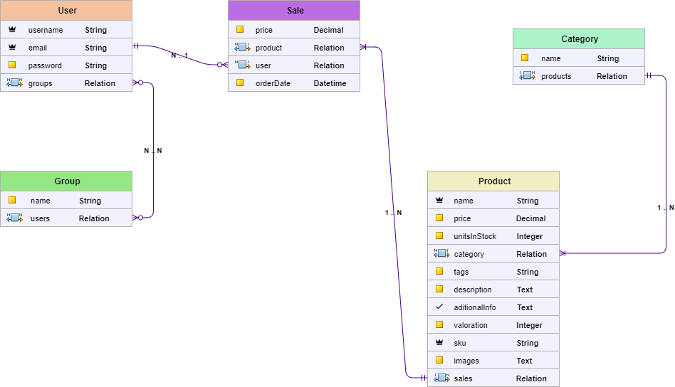
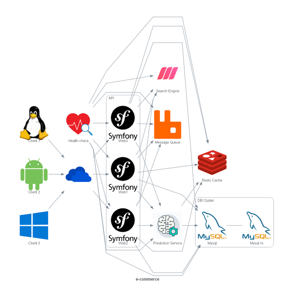

# ecommerce-impl
A simple e-commerce project exercise implementation in diferent 
programming languages and techs. Using a Clean Architecture principles.

### Data model


### Project architecture

* Independent of database engine
* Level 2 of Richardson Maturity Model
* Use JWT
* Use [Meilisearch](https://www.meilisearch.com/docs) as search engine
* Use [Redis](https://redis.io/) as cache
* Use [Rabbitmq](https://www.rabbitmq.com/) as message queue

#### Routes

| Method    | Path                        | Role Required    | Description                                    |
| --------- | --------------------------- | ---------------- | ---------------------------------------------- |
| POST	   | /api/login	  | Anonymous	 | Auth                                           |
| POST	   | /api/product/create	  | Editor or Admin	 | Create a new product                           |
| DELETE	   | /api/product/delete/{id}	  | Editor or Admin	 | Delete a Product                               |
| GET	   | /api/product/{sku}	  | User	 | Get a product by Sku(Uuid v4) property         |      
| PATCH	   | /api/product/update/{id}	  | Editor or Admin	 | Update a product using  Id property            |            
| GET	   | /api/product/search	  | User	 | Search a product                               |
| GET	   | /api/product/search-total	  | User	 | Get total of product that match with a search  |                      
| GET	   | /api/product/out-stock	  | Editor or Admin	 | List Products out of stock                     |   
| POST	   | /api/sale/create	  | User	 | Sale a product                                 |
| GET	   | /api/sale/list-products	  | User	 | List all products that has been sale           |             
| GET	   | /api/sale/calc-profit	  | Editor or Admin	 | Get the profit of sales                        |
| POST	   | /api/user/register	  | Anonymous	 | Register a new user                            |
| GET	   | /api/user	  | User	 | Get user info using the JWT token              |          
| PATCH	   | /api/user/update/{id}	  | Admin	 | Update a user                                  |
| GET	   | /api/user/list	  | Admin	 | Get the use list                               |


### System design


### Run project
* [PHP with Symfony 6.2](php-symfony-backend/README.md)


### Run integration tests
```
cd nodejs-integration-tests
yarn
yarn start
```

### Todo

* finish the OpenAPI v3 specification 
* implement a prediction server
* implement a recomendation engine
* implement a health check API
* create an implementation in SpringBoot
* create an implementation in ASP.NET Core
* create an implementation in Golang
* create an implementation in Ruby on Rails
* create an implementation in Django
* create an implementation in Flask
* create an implementation in Express
* create an implementation in Laravel